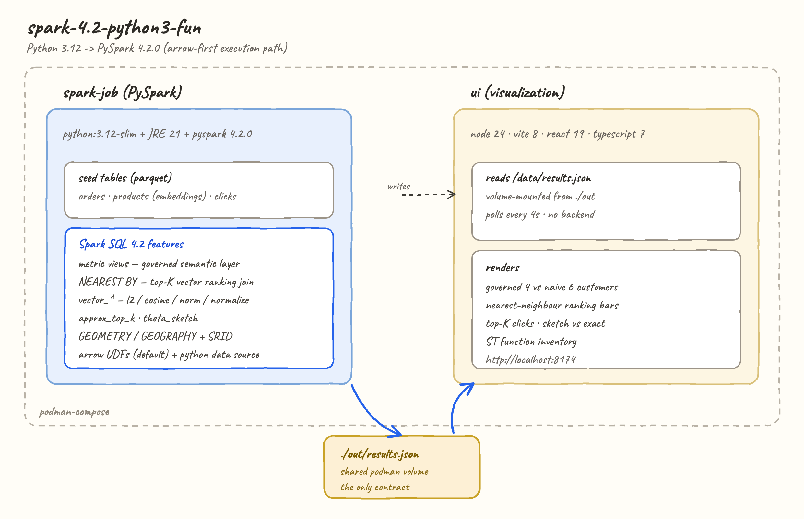
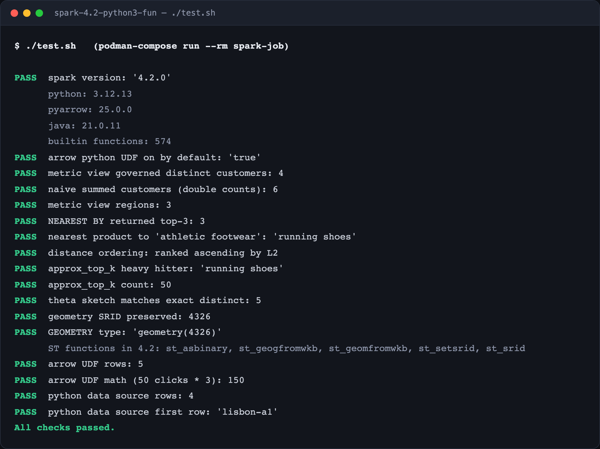
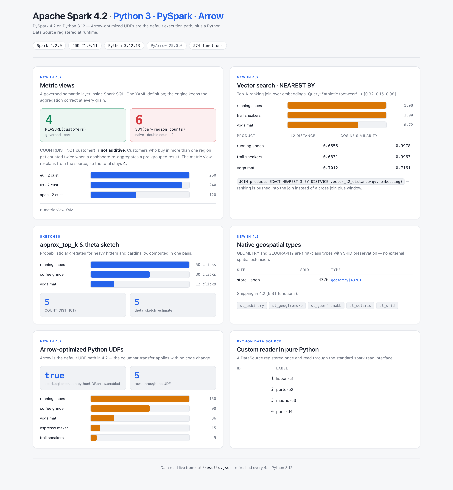

# spark-4.2-python3-fun

Apache Spark **4.2.0** driven from **Python 3.12 (PySpark)**, containerised with podman, with a React/TypeScript 7 UI that visualises the results.

Every number in this README came from actually running the job — the UI and the screenshots read `out/results.json`.



---

## What's new in Spark 4.2

Spark 4.2 (~1,900 commits from 260+ contributors) moves much of the modern data/AI stack into the engine. The headline items, and which ones this POC exercises:

| Feature | What it is | Here? |
|---|---|---|
| **Arrow-first Python** | Arrow-optimized Python UDFs **on by default** — existing UDFs get the columnar path with no rewrite. Plus Arrow UDFs, Pandas 3, and zero-copy to Polars/DuckDB via the Arrow C Data Interface / PyCapsule. | yes |
| **Python Data Sources** | Batch/streaming readers & writers written in pure Python, registered once and used through `spark.read.format(...)`. | yes |
| **Metric views** | A governed semantic layer in Spark SQL — dimensions & measures as first-class objects so the engine preserves aggregation semantics. | yes |
| **Vector functions** | `vector_l2_distance`, `vector_cosine_similarity`, `vector_inner_product`, `vector_norm`, `vector_normalize`, `vector_sum`, `vector_avg`. | yes |
| **`NEAREST BY`** | A top-K ranking *join* for distance/similarity matching. | yes |
| **Sketches / ranking** | `approx_top_k`, `theta_sketch_*`, `hll_sketch_*`, `kll_sketch_*`, `count_min_sketch`. | yes |
| **Native geospatial** | `GEOMETRY` / `GEOGRAPHY` types with SRID preservation. | yes |
| **Spark Connect** | gRPC + Arrow client/server split; 4.2 narrows the gap with Spark Classic (RDD compat, YARN cluster mode, better errors). | no (runs Classic) |
| **Auto CDC / Real-Time Mode** | SCD Type 1 via Declarative Pipelines; millisecond streaming, now on PySpark for stateless queries. | no |
| **Platform** | JDK 25, modernised Web UI, K8s improvements. | JDK 21 runtime |

Source: [Introducing Apache Spark 4.2](https://www.databricks.com/blog/introducing-apache-spark-42).

### A caveat worth knowing

The blog frames geospatial broadly, but 4.2 OSS ships exactly **five** `ST_*` functions — `st_asbinary`, `st_geogfromwkb`, `st_geomfromwkb`, `st_setsrid`, `st_srid`. The *types* work and SRID round-trips, but there are no predicates/measures (`st_distance`, `st_area`, `st_intersects`) yet. The UI lists what the engine actually reports.

---

## The stack

| Layer | Choice | Why |
|---|---|---|
| Engine | Apache Spark 4.2.0 | the release under test |
| Language | **Python 3.12** + PySpark 4.2.0 | requires Python ≥ 3.10 |
| Arrow | pyarrow | the Arrow UDF transport |
| Runtime | python:3.12-slim + openjdk-21-jre | the JVM still runs the engine |
| Containers | podman + podman-compose | |
| UI | node 24 · vite 8 · react 19 · **typescript 7.0.2** | TS 7 is the native (Go) compiler |

PySpark 4.2.0 ships as a **450 MB source tarball** (no wheel). `fetch-deps.sh` downloads it once into `vendor/` with resume + retry (pip's own retries restart the whole 450 MB on a dropped connection, which is miserable on a slow link), and the `Containerfile` installs from that local file. `test.sh` and `start.sh` call `fetch-deps.sh` for you; `vendor/` is git-ignored.

---

## Pros and cons of this approach

**Pros**

- The most direct path to Spark 4.2 — `pip install pyspark==4.2.0`, no cross-compilation, no artifact tricks.
- **Typed collections work**: `spark.createDataFrame`, Python data sources, UDFs — none of the Scala 3 encoder limitations.
- Arrow-optimized UDFs are the default, so the columnar speedup applies with zero code change.
- Python Data Sources let you wrap any Python-reachable system as a first-class Spark source in a few lines.
- One JSON file is the whole contract to the UI — no backend.

**Cons**

- Python UDF/data-source code still crosses the JVM↔Python boundary; Arrow narrows but doesn't erase it.
- The image is large (JRE + 450 MB PySpark source); first build is slow.
- `local[*]` in one container demonstrates the API, not cluster scaling.
- Dynamic typing means schema mistakes surface at runtime — which is exactly why the UI is typed with TypeScript 7.

---

## Steps to run

Requires podman and podman-compose. No Python, JDK or node needed on the host.

Two scripts do everything — the job and the UI both run as podman containers:

```bash
./start.sh   # run the job, then serve the UI at http://localhost:8174
./stop.sh    # tear everything down
./test.sh    # run the job in podman and assert on the results
./links.sh   # open the UI in your browser
```

The UI reads `out/results.json` and refreshes every 4 seconds, so if you open it before the job has written results you get a light "waiting" screen that fills in on its own — no reload needed.

---

## Results

`test.sh` runs the job in a container and asserts against real output:



The UI reads the same `out/results.json`:



### Arrow UDFs, on by default

`runtime.arrowPythonUdfDefault` reads back `true` straight from `spark.sql.execution.pythonUDF.arrow.enabled` — in 4.2 a plain `@udf` already takes the Arrow columnar path. The job runs one over the click counts (`clicks × 3`) purely to show a stock Python UDF executing on that path unchanged.

### Python Data Source

`InventoryDataSource` is ~15 lines of pure Python — a `DataSource` + `DataSourceReader` — registered at runtime and read back through the standard interface:

```python
spark.dataSource.register(InventoryDataSource)
spark.read.format("inventory").load()   # -> lisbon-a1, porto-b2, madrid-c3, paris-d4
```

No JAR, no connector build. The same shape extends to batch or streaming readers/writers over anything Python can reach.

### The metric view result is the interesting one

The seeded `orders` table has customers who buy in more than one region (`ana` in `us` and `eu`, `cleo` in `eu` and `apac`). `COUNT(DISTINCT customer)` is **not additive**:

| query | answer |
|---|---|
| `SELECT MEASURE(customers) FROM revenue_mv` | **4** — correct: ana, bob, cleo, dan |
| `SELECT SUM(customers) FROM (… GROUP BY region)` | **6** — wrong: ana and cleo counted twice |

Both read the *same* measure. The metric view re-plans from the source at the requested grain instead of re-aggregating a pre-grouped result — the class of bug you get when a dashboard, a notebook and an AI agent each rewrite "active customers" themselves.

Note: a metric view must be a **catalog** view. `CREATE TEMP VIEW … WITH METRICS` fails with `PARSE_SYNTAX_ERROR at or near 'METRICS'`.

### Vector search

Query vector `[0.92, 0.15, 0.08]` ("athletic footwear") against 3-d product embeddings:

```sql
FROM query q JOIN products p
EXACT NEAREST 3 BY DISTANCE vector_l2_distance(q.qv, p.embedding)
```

returns `running shoes` → `trail sneakers` → `yoga mat`, ranked ascending by L2, coffee products excluded.

**Gotcha:** the `vector_*` functions require `ARRAY<FLOAT>` strictly. `array(1.0, 0.0)` is `ARRAY<DOUBLE>` and fails with `DATATYPE_MISMATCH.UNEXPECTED_INPUT_TYPE`; write `array(1.0f, 0.0f)` or cast. There is no `VECTOR` type — a vector is an `array<float>`.

---

## Layout

```
spark-4.2-python3-fun/
├── app/job.py                    the job: seeds tables, runs the demos, writes JSON
├── Containerfile                 python:3.12-slim + JRE 21 + pyspark 4.2.0
├── fetch-deps.sh                 resumable download of the pyspark tarball -> vendor/
├── podman-compose.yml            spark-job + ui, sharing ./out
├── start.sh / stop.sh / test.sh
├── out/results.json              the job's output (the UI's only input)
├── printscreens/
└── ui/                           vite + react 19 + typescript 7 (light theme)
    ├── src/App.tsx
    └── Containerfile
```
