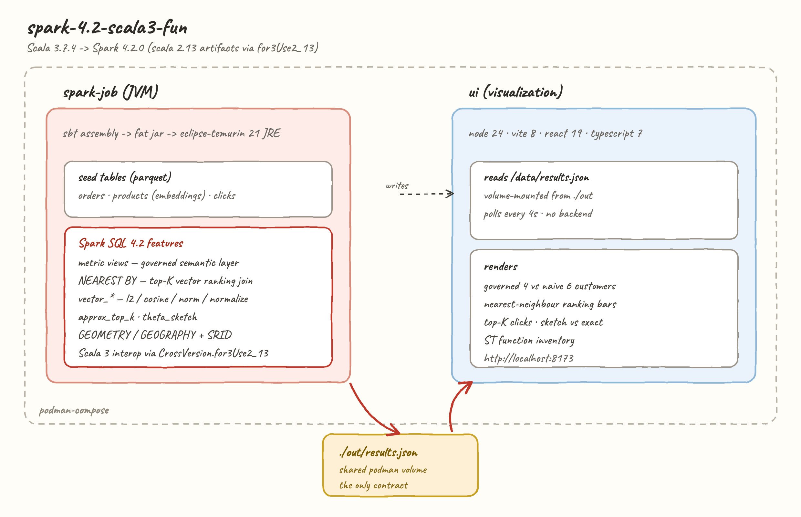
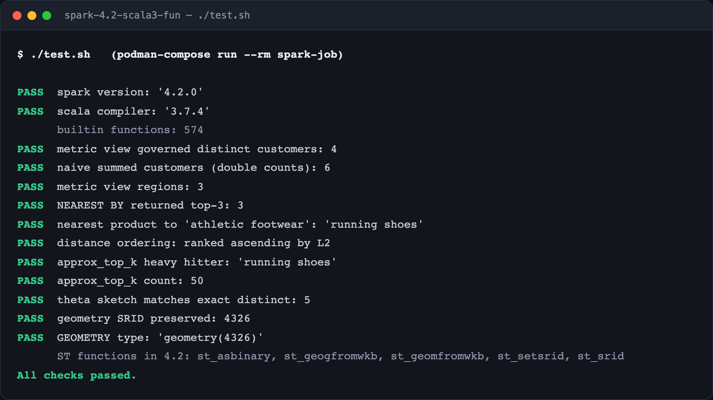
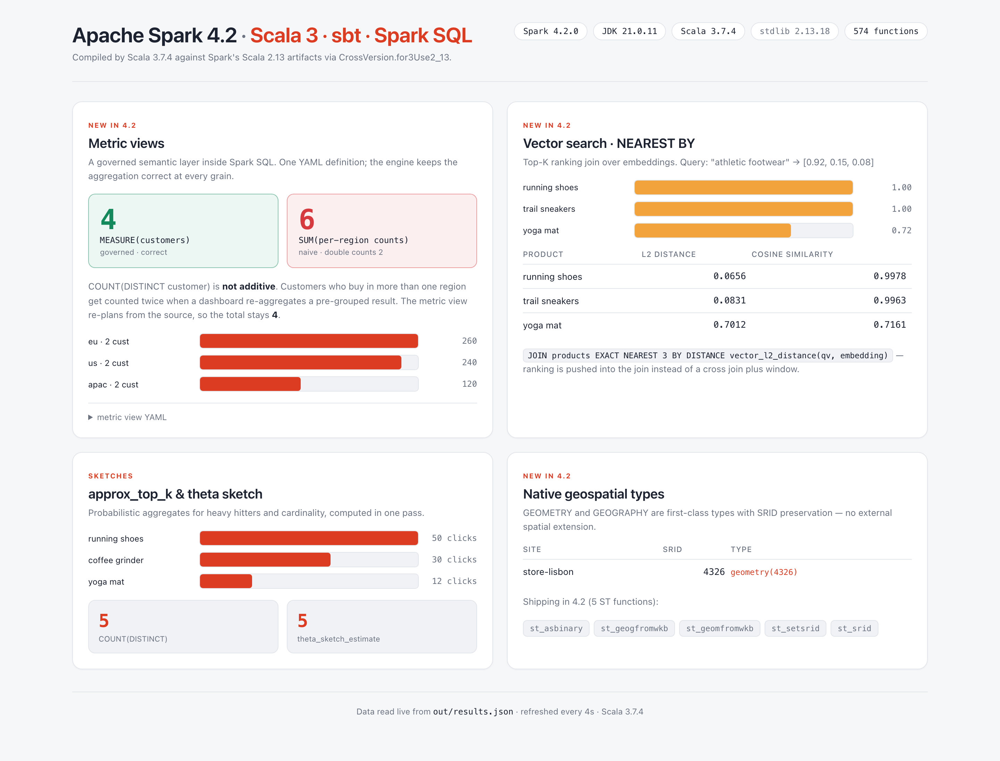

# spark-4.2-scala3-fun

Apache Spark **4.2.0** driven from **Scala 3.7.4**, containerised with podman, with a React/TypeScript 7 UI that visualises the results.

Everything in this README was produced by actually running the code — the numbers in the screenshots come from `out/results.json`.



---

## What's new in Spark 4.2

Spark 4.2 (~1,900 commits from 260+ contributors) pulls a lot of the modern data/AI stack into the engine itself. The headline items, and which ones this POC exercises:

| Feature | What it is | Here? |
|---|---|---|
| **Metric views** | A governed semantic layer in Spark SQL. Dimensions and measures become first-class objects, so the engine preserves aggregation semantics instead of trusting each consumer to rewrite the formula. | yes |
| **Vector functions** | `vector_l2_distance`, `vector_cosine_similarity`, `vector_inner_product`, `vector_norm`, `vector_normalize`, `vector_sum`, `vector_avg`. | yes |
| **`NEAREST BY`** | A top-K ranking *join* for distance/similarity matching — retrieval and candidate generation without a cross join plus window. | yes |
| **Sketches / ranking** | `approx_top_k` (+ `_accumulate`/`_combine`/`_estimate`), `theta_sketch_*`, `hll_sketch_*`, `kll_sketch_*`, `count_min_sketch`. | yes |
| **Native geospatial** | `GEOMETRY` / `GEOGRAPHY` types with SRID preservation, WKT/WKB, Parquet support. | yes |
| **Arrow-first Python** | Arrow-optimized Python UDFs on by default; Arrow UDFs; Pandas 3; Arrow C Data Interface / PyCapsule zero-copy to Polars & DuckDB. | see the [Python POC](../spark-4.2-python3-fun) |
| **Auto CDC / DSv2 CDC** | `CHANGES` clause, SCD Type 1 via Declarative Pipelines. | no |
| **Real-Time Mode** | Millisecond-latency Structured Streaming, extended to PySpark for stateless queries. | no |
| **Platform** | JDK 25 support, Web UI modernised (Bootstrap 5, dark mode), K8s heterogeneous executors, History Server scaling. | JDK 25 verified |

Source: [Introducing Apache Spark 4.2](https://www.databricks.com/blog/introducing-apache-spark-42).

### A caveat worth knowing

The blog frames geospatial broadly, but 4.2 OSS ships exactly **five** `ST_*` functions — `st_asbinary`, `st_geogfromwkb`, `st_geomfromwkb`, `st_setsrid`, `st_srid`. The *types* are real and SRID round-trips correctly, but there are no predicates or measures (`st_distance`, `st_area`, `st_intersects`) yet. The UI lists what the engine actually reports, so this stays honest.

---

## The stack

| Layer | Choice | Why |
|---|---|---|
| Engine | Apache Spark 4.2.0 (Scala 2.13.18 build) | the release under test |
| Language | **Scala 3.7.4** | Spark publishes no Scala 3 artifacts; see below |
| Build | sbt 1.11.6 + sbt-assembly | fat jar → plain JRE, no SPARK_HOME |
| Runtime | eclipse-temurin 21 JRE | Spark 4.2 supports 17 / 21 / 25 |
| Containers | podman + podman-compose | |
| UI | node 24 · vite 8 · react 19 · **typescript 7.0.2** | TS 7 is the native (Go) compiler |

### Scala 3 → Spark: the part that actually bites

Spark has **no Scala 3 artifacts** — only `_2.13`. Scala 3 consumes them via:

```scala
("org.apache.spark" %% "spark-sql" % "4.2.0").cross(CrossVersion.for3Use2_13)
```

That compiles cleanly. But **you must stay on Scala 3.7.x or the 3.3.x LTS line — not 3.8.x.**

`SparkSession.builder()` locates its implementation through `scala.reflect.runtime.currentMirror`, i.e. Scala **2.13** runtime reflection. Scala 3.8 replaced the 2.13 standard library with its own `scala-library` 3.8.x, and scala-reflect 2.13 cannot build its symbol table against it. The failure is badly misleading, because Spark swallows the cause in a `Try`:

```
java.lang.IllegalStateException: Cannot find a SparkSession implementation on the Classpath.
```

The class is on the classpath — `Class.forName` finds it. The real error, only visible if you reproduce the lookup by hand, is:

```
scala.reflect.internal.FatalError: class Array does not have a member apply
```

Scala 3.7.4 and 3.3.x depend on `scala-library` 2.13.16, so reflection initialises and Spark works. This POC pins **3.7.4**.

Two follow-on consequences, both visible in the code:

- `scala.util.Properties.versionNumberString` reports **2.13.18** at runtime even though the sources are Scala 3. That's the 2.13 stdlib underneath — expected, not a misconfiguration. The UI shows both.
- **`Dataset[MyCaseClass]` does not work.** Encoders need Scala 2 `TypeTag`s, which Scala 3 does not emit. So `spark.createDataFrame(Seq(...))` and `.as[CaseClass]` are out. This POC uses the `DataFrame` + SQL API throughout — including seeding via SQL `range()` instead of `createDataFrame`.

---

## Pros and cons of this approach

**Pros**

- Scala 3's syntax, `given`s, enums and exhaustivity on top of a mature engine, today.
- The fat jar runs on a stock JRE — no Spark install, no `SPARK_HOME`, no `spark-submit`.
- `DataFrame` + SQL is fully available; every 4.2 feature here works unchanged from Scala 3.
- The contract between job and UI is one JSON file, so the UI needs no backend.

**Cons**

- **Typed `Dataset`s are unavailable.** For a codebase built on `Dataset[T]` this is close to disqualifying — you'd stay on Scala 2.13.
- Locked out of Scala 3.8+ until Spark stops using 2.13 runtime reflection for session lookup.
- `for3Use2_13` is an escape hatch: no compiler check that a 2.13 library is safe to call from 3.x, and diagnostics degrade to reflection-time errors.
- The fat jar is ~290 MB; the first build downloads all Spark jars.
- `local[*]` in one container is not a cluster — this shows the API surface, not scaling behaviour.

---

## Steps to run

Requires podman and podman-compose. Nothing else — no JDK, sbt or node on the host.

Two scripts do everything — the job and the UI both run as podman containers:

```bash
./start.sh   # run the job, then serve the UI at http://localhost:8173
./stop.sh    # tear everything down
./test.sh    # run the job in podman and assert on the results
./links.sh   # open the UI in your browser
```

The UI reads `out/results.json` and refreshes every 4 seconds, so if you open it before the job has written results you get a light "waiting" screen that fills in on its own — no reload needed.

First `start.sh`/`test.sh` takes a while: it downloads Spark's jars and builds the fat jar. Later runs hit the layer cache.

---

## Results

`test.sh` runs the job in a container and asserts against real output:



The UI reads the same `out/results.json`:



### The metric view result is the interesting one

The seeded `orders` table has customers who buy in more than one region (`ana` in `us` and `eu`, `cleo` in `eu` and `apac`). `COUNT(DISTINCT customer)` is **not additive**, so:

| query | answer |
|---|---|
| `SELECT MEASURE(customers) FROM revenue_mv` | **4** — correct: ana, bob, cleo, dan |
| `SELECT SUM(customers) FROM (… GROUP BY region)` | **6** — wrong: ana and cleo counted twice |

Both read the *same* measure. The metric view re-plans from the source at the requested grain instead of re-aggregating a pre-grouped result, which is exactly the class of bug that appears when a dashboard, a notebook and an AI agent each rewrite "active customers" themselves.

```yaml
version: 0.1
source: orders
dimensions:
  - name: region
    expr: region
measures:
  - name: revenue
    expr: SUM(amount)
  - name: customers
    expr: COUNT(DISTINCT customer)
```

Note: a metric view **must** be a catalog view. `CREATE TEMP VIEW … WITH METRICS` fails with `PARSE_SYNTAX_ERROR at or near 'METRICS'`.

### Vector search

`products` holds 3-d embeddings; the query vector is `[0.92, 0.15, 0.08]` ("athletic footwear"):

```sql
SELECT p.name,
       vector_l2_distance(q.qv, p.embedding)      AS distance,
       vector_cosine_similarity(q.qv, p.embedding) AS similarity
FROM query q JOIN products p
EXACT NEAREST 3 BY DISTANCE vector_l2_distance(q.qv, p.embedding)
```

returns `running shoes` → `trail sneakers` → `yoga mat`, ranked ascending by L2, with the coffee products correctly excluded.

The grammar is:

```
nearestByClause : (APPROX | EXACT) NEAREST num=INTEGER_VALUE? BY (DISTANCE | SIMILARITY) expression
```

Only `INNER` and `LEFT OUTER`; no `LATERAL`; K defaults to 1. In 4.2 `APPROX` and `EXACT` share the same brute-force rewrite — the flag reserves the contract for future indexed ANN strategies.

**Gotcha:** the vector functions require `ARRAY<FLOAT>` strictly. `array(1.0, 0.0)` is `ARRAY<DOUBLE>` and fails with `DATATYPE_MISMATCH.UNEXPECTED_INPUT_TYPE`; write `array(1.0f, 0.0f)` or cast. There is no `VECTOR` type — a vector is an `array<float>`.

---

## Layout

```
spark-4.2-scala3-fun/
├── build.sbt                     scala 3.7.4 + for3Use2_13 + assembly
├── src/main/scala/Main.scala     the job: seeds tables, runs the demos, writes JSON
├── Containerfile                 sbt assembly -> temurin 21 JRE
├── podman-compose.yml            spark-job + ui, sharing ./out
├── start.sh / stop.sh / test.sh
├── out/results.json              the job's output (the UI's only input)
├── printscreens/
└── ui/                           vite + react 19 + typescript 7 (light theme)
    ├── src/App.tsx
    └── Containerfile
```
